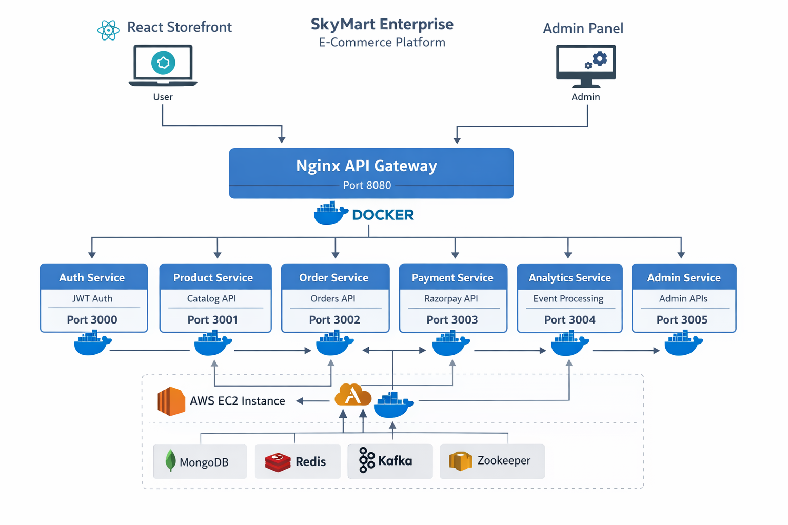

SkyMart Enterprise — Distributed E-Commerce Platform

SkyMart Enterprise is a production-style monorepo implementing a microservices-based e-commerce platform with separate Storefront and Admin applications, containerized backend services, and event-driven communication.

This project demonstrates distributed system architecture, Docker orchestration, API Gateway routing, and AWS EC2 deployment.

Live Deployment

Storefront: https://www.skymartapp.com

Admin Panel: https://admin.skymartapp.com

API Gateway: https://api.skymartapp.com

Demo admin access available upon request.

Architecture Overview

System Flow

Storefront and Admin applications communicate via HTTPS to the API Gateway.

Nginx (Docker container) routes traffic to backend microservices.

Each service runs in an isolated Docker container.

Services communicate internally via Docker networking.

Kafka enables asynchronous event-driven workflows.

MongoDB and Redis provide persistence and caching layers.

Microservices
Service	Port	Responsibility
auth-service	3000	JWT authentication & role-based access control
product-service	3001	Product catalog APIs
order-service	3002	Order lifecycle management
payment-service	3003	Razorpay integration & verification
analytics-service	3004	Kafka-based event processing
admin-service	3005	Administrative APIs
nginx (API Gateway)	8080	Reverse proxy & routing
Infrastructure Containers

MongoDB

Redis

Kafka

Zookeeper

All services are orchestrated via Docker Compose on AWS EC2 (Ubuntu).

Frontend Applications
Storefront (/frontend)

React + Vite

Customer-facing SPA

Admin Panel (/admin)

React + Vite

Administrative management interface

Both frontends are deployed on Vercel.

Technology Stack
Frontend

React (Vite)

Tailwind CSS

React Router

Backend

Node.js microservices (REST APIs)

Nginx API Gateway

Infrastructure

Docker

Docker Compose

MongoDB

Redis

Apache Kafka

Zookeeper

Cloud & Hosting

AWS EC2 (Ubuntu)

Vercel (Frontend hosting)

HTTPS with custom domains

Docker & Infrastructure

The backend stack is managed using Docker Compose:

cd skymart-enterprise-backend
docker compose up -d

All microservices run as isolated containers.

Infrastructure services (MongoDB, Redis, Kafka, Zookeeper) run within the same compose network.

The Nginx container exposes port 8080 and forwards traffic to internal services.

Event-Driven Design

Kafka is used for asynchronous communication between services:

Payment verification → Order service update

Order creation → Analytics processing

This architecture improves scalability, decouples services, and enables resilient workflows.

Local Development
Start Backend & Infrastructure
cd skymart-enterprise-backend
docker compose up -d
Run Storefront
cd frontend
npm install
npm run dev
Run Admin Panel
cd admin
npm install
npm run dev
Deployment Strategy

Frontend: Deployed on Vercel with SPA rewrite configuration.

Backend: Deployed on AWS EC2 using Docker Compose.

API Gateway: Nginx container handles routing and TLS termination.

Networking: HTTPS enforced in production.

Security Considerations

JWT-based authentication and authorization

Role-based access control

Environment-based secret management

Razorpay server-side signature verification

Gateway-level routing isolation

Engineering Highlights

Microservices-based architecture

Event-driven communication using Kafka

API Gateway pattern

Container-first deployment model

Cloud deployment on AWS EC2

Domain + SSL configuration

Production debugging and service isolation experience

License

MIT License